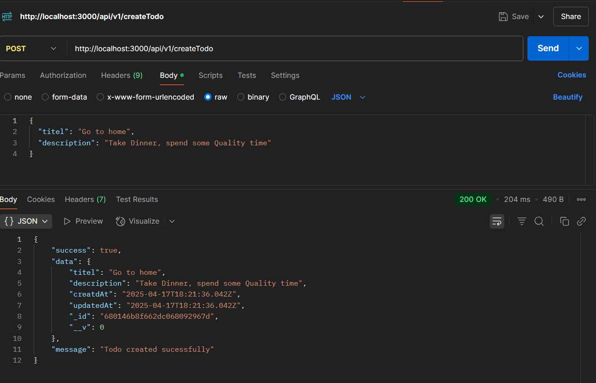
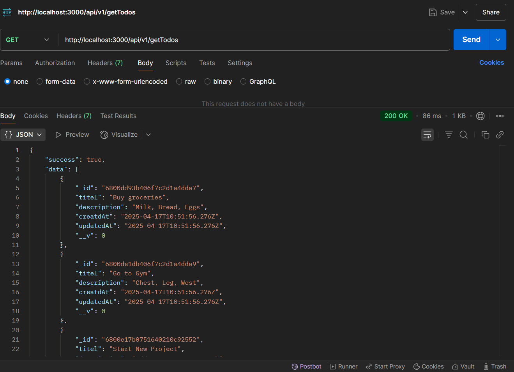
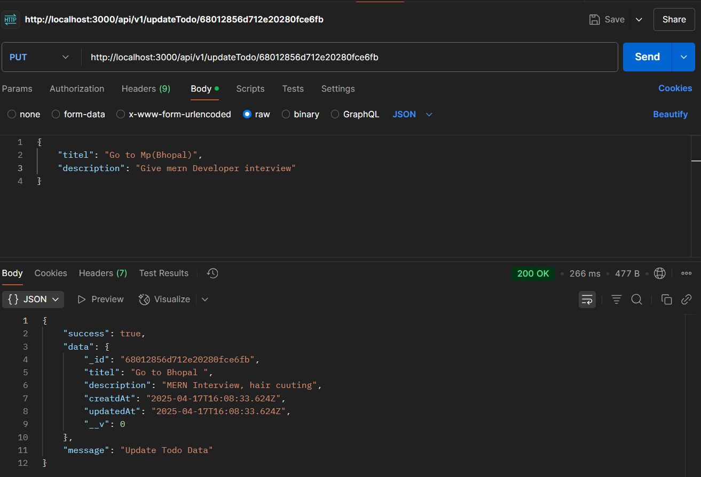
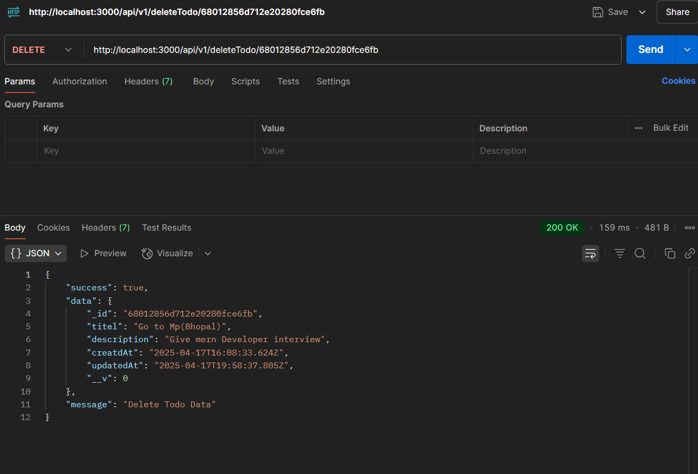

# Todo App

  

An attractive, simple RESTful API for managing **Todo** items using **Node.js**, **Express**, and **MongoDB**.

---

## Overview

This API allows you to **create**, **read**, **update**, and **delete** todo items. Perfect for quick prototyping or learning the MERN backend stack.

## Features

- Create a new todo
- Retrieve all todos
- Retrieve a todo by its ID
- Update an existing todo
- Delete a todo
- Structured JSON responses with success flags and messages

## Tech Stack

- **Node.js** & **Express.js**
- **MongoDB** via **Mongoose**
- Environment management with **dotenv**
- Live reloading with **nodemon**

## Installation

1. Clone the repo:
   ```bash
   git clone https://github.com/Singhdhiru/Todo-App.git
   cd Todo-APP
   ```
2. Install dependencies:
   ```bash
   npm install
   ```
3. Create a `.env` file in root:
   ```env
   PORT=3000
   MONGO_URI=<your_mongodb_connection_string>
   ```
4. Start the server:
   ```bash
   npm run dev
   ```
   _Server will be listening at_ `http://localhost:3000`

## API Endpoints

Base URL _(`/api/v1`)_

| Method | Endpoint               | Description             |
|--------|------------------------|-------------------------|
| POST   | `/createTodo`          | Create a new todo       |
| GET    | `/getTodos`            | Fetch all todos         |
| GET    | `/getTodoById/:id`     | Fetch a single todo     |
| PUT    | `/updateTodo/:id`      | Update an existing todo |
| DELETE | `/deleteTodo/:id`      | Delete a todo           |

### Example Requests

**Create Todo**
```bash
curl -X POST http://localhost:3000/api/v1/createTodo \
     -H "Content-Type: application/json" \
     -d '{"titel":"Buy groceries","description":"Milk, Bread, Eggs"}'
```

**Get Todo by ID**
```bash
curl http://localhost:3000/api/v1/getTodoById/68012856d712e20280fce6fb
```

## Postman Collection

<p align="center">
  
  
  
  
  
</p>

Import the above collection to test all endpoints quickly.

---

## License

This project is licensed under the **MIT License**.